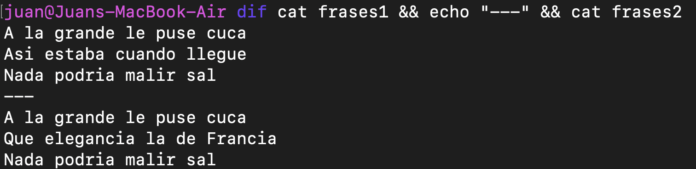

# Diff en Rust

Un programa para encontrar las diferencia entre dos archivos.

---

## Posibles aplicaciones

Seguimiento de versiones (git).

---

# Como opera el programa.

---

## Archivos de ejemplo

archivo1:
```typescript=
a
b
c
```

archivo2:

```typescript=
a
c
```

Veamos qué hace diff internamente

---

# LCS.

1. Armado de una grilla.
2. Recorrido de esa grilla.

---

## Armado

```typescript=
      a b c
    0 0 0 0
  a 0 1 1 1
  c 0 1 1 2
```
Grilla de dimensiones (n,m) donde n = len(archivo1) + 1 y m = len(archivo2) + 1.

---

```rust
fn lcs(f1: &[String], f2: &[String]) -> Vec<Vec<usize>> {
    let m = &f1.len();
    let n = &f2.len();

    let mut c = vec![vec![0; *n + 1]; *m + 1];

    for (i, f1_line) in f1.iter().enumerate() {
        for (j, f2_line) in f2.iter().enumerate() {
            if f1_line == f2_line {
                c[i + 1][j + 1] = c[i][j] + 1;
            } else {
                c[i + 1][j + 1] = cmp::max(c[i + 1][j], c[i][j + 1])
            }
        }
    }

    c
}
```

---

## Recorrido

```
      a b c
    0 0 0 0
  a 0 1 1 1
  c 0 1 1 2
```
- Arranca en c(4,3) 
- Va a b(3,2) y toma c porque (4,3) ≠ (4,2), (3,3) 
- Va al maximo a(2,3) 
- a(2,3) es el mismo caso que al principio 
- Llega al borde; deja de iterar.

---

```rust
fn print_diff(c: &Vec<Vec<usize>>, f1: &[String], f2: &[String], i: usize, j: usize) {
    if i > 0 && j > 0 && f1[i - 1] == f2[j - 1] {
        print_diff(c, f1, f2, i - 1, j - 1);
        println!("{}", f1[i - 1]);
    } else if j > 0 && (i == 0 || c[i][j - 1] >= c[i - 1][j]) {
        print_diff(c, f1, f2, i, j - 1);
        println!("> {}", f2[j - 1]);
    } else if i > 0 && (j == 0 || c[i][j - 1] < c[i - 1][j]) {
        print_diff(c, f1, f2, i - 1, j);
        println!("< {}", f1[i - 1]);
    } else {
        println!();
    }
}
```

---

## Lectura de archivos

Se ejecuta el programa desde la línea de comandos `diff archivo1 archivo2`

```rust
fn get_filenames() -> (String, String) {
    let files: Vec<String> = env::args().collect();

    if files.len() < 3_usize {
        panic!("Expected 2 arguments, got {}", files.len() - 1);
    }

    (files[1].clone(), files[2].clone())
}

fn read_file_lines(filename: String) -> Vec<String> {
    let file: String = fs::read_to_string(filename).expect("Couldn't read file ");
    file.lines().map(|l| l.to_string()).collect()
}
```

---

### Ejemplo




